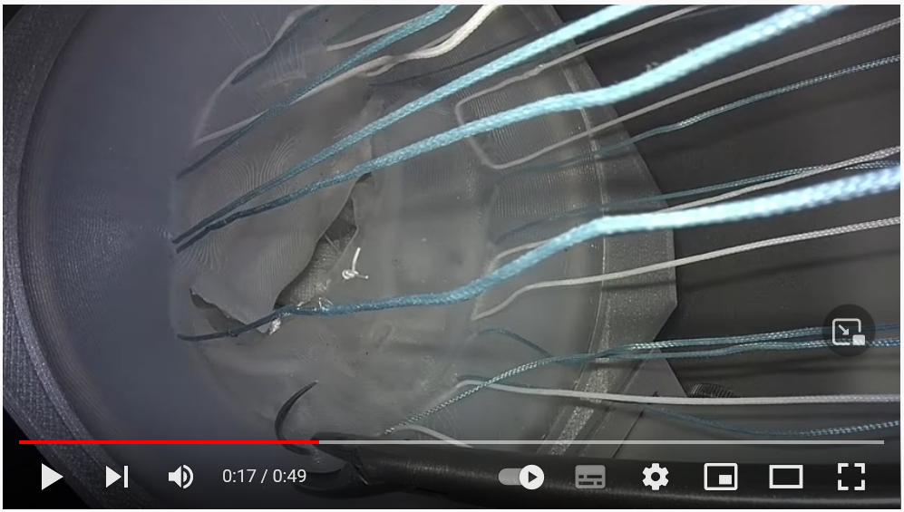

### <a id="Data_Purposes" class="uncolored_link">Data Purposes</a>
The purpose of disseminating the data is to perform a novel view synthesis task in endoscopic images of mitral valve repair.
This analysis is taking place in the context of the AdaptOR challenge. The data is downloaded for this sole purpose and
cannot be used in another context until the embargo period has expired. 

### <a id="MVRepair" class="uncolored_link">Mitral Valve Repair</a>

Mitral valve repair is a heart surgery, which is aimed at re-storing the function of the mitral valve. During the surgery, the valve is not replaced but different surgical techniques are employed. For example, an annuloplasty ring prosthesis or a neo-chordae could be inserted. 
The goal of this challenge is to synthesise a novel view for the endoscopic data. During training, the participants are provided the left and the right stereo camera images, and the test time task is to predict the corresponding image for a given image from the left camera.

### <a id="Simulator" class="uncolored_link">Mitral Valve Repair Simulator</a>

 

A video of minimally invasive simulation can be found on <a href="https://www.youtube.com/watch?v=U8cc5ilBM04"> Youtube </a>.

### <a id="Data" class="uncolored_link">Data</a>

The challenge cohort splits into two endoscopic sets:
1. Data acquired during **simulating mitral valve repair** on a surgical simulator ("Sim-Domain“). Valvular anatomy was extracted from 3D transesophageal echocardiography. More information on the simulator can be found in [1] and [2].
2. Intraoperative endoscopic data from **real minimally invasive mitral valve repair** ("Intraop-Domain").

Data was recorded by a stereo-endoscope, which delivers two images of the same scene at the same time. 
One case refers to one stereo frame extracted from the simulation sessions and the intra-operative videos. Stereo-frames were saved in top-down format (left image top, right image bottom) and split.

**Training Sim-Domain:**
1366 stereo frames from 10 simulations (99-187 frames each) with an average of 136 frames per simulation.

**Training Intraop-Domain:**
5395 stereo frames from 9 patients (346-1102 frames each) with an average of 600 frames per surgery/patient.

**Testing Intraop-Domain:**
450 mono frames from 5 patients (100 frames from each). Patients are different from the training set.

Besides the frames themselves, we release to which (anonymized) patient and domain the frame belongs to. 
The number of frames per simulation/patient in the training data set are not equal, but are on the same scale. We balanced the number of frames per patient in the test data. Therefore, each patient in the test set has a similar influence on the final score.

### <a id="References" class="uncolored_link">References</a>

[1] Engelhardt S, Sauerzapf S, Brčić A, Karck M, Wolf I, De Simone R. Replicated mitral valve models from real patients offer training opportunities for minimally invasive mitral valve repair. Interact Cardiovasc Thorac Surg. 2019 Jul 1;29(1):43-50. doi: 10.1093/icvts/ivz008.

[2] Engelhardt, S., Sauerzapf, S., Preim, B., Karck, M., Wolf, I., De Simone, R., Flexible and Comprehensive Patient-Specific Mitral Valve Silicone Models with Chordae Tendinae Made From 3D-Printable Molds. Int J Comput Assist Radiol Surg Special Issue IPCAI 2019. 14(7):1177–1186, doi: 10.1007/s11548-019-01971-9. Preprint: <a href="https://arxiv.org/abs/1904.03704">1904.03704</a>

