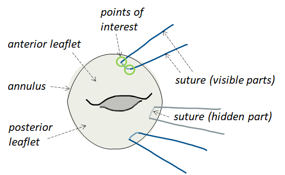

### <a id="Data_Purposes" class="uncolored_link">Data Purposes</a>
(1) By **registering** in the challenge, the participants agree to cite the following works if using the data for a
publication:
* Sharan, L., Romano, G., Koehler, S., Kelm, H., Karck, M., De Simone, R., & Engelhardt, S. (2021). Mutually improved endoscopic image synthesis and landmark detection in unpaired image-to-image translation. IEEE Journal of Biomedical and Health Informatics, 1–1. doi:10.1109/JBHI.2021.3099858

* Sharan, L., Romano, G., Brand, J., Kelm, H., Karck, M., De Simone, R., & Engelhardt, S. (2021). Point detection through multi-instance deep heatmap regression for sutures in endoscopy. International Journal of Computer Assisted Radiology and Surgery. doi:10.1007/ s11548-021-02523-w

(2) The **embargo** period of the challenge has concluded, and the AdaptOR challenge is re-opened to further submissions that are subject to continuous evaluation. In making a submission to the AdaptOR challenge, the participants agree to participate in a joint publication that will be planned by the organisers, once sufficient submissions are received.

### <a id="License" class="uncolored_link">License</a>
The Data is released under a Creative Commons Attribution- NonCommercial-ShareAlike (**CC BY- NC-SA**) license, which means that it will be publicly available for non-commercial usage.

### <a id="MVRepair" class="uncolored_link">Mitral Valve Repair</a>

Mitral valve repair is a heart surgery, which is aimed at re-storing the function of the mitral valve. During the surgery, the valve is not replaced but an **annoloplasty ring** is inserted to stabilize the mitral annulus. The prosthetic ring is anchored by **white and blue matress sutures** stitched in a particular pattern into the annulus. 
The goal of this challenge is to detect the **points where these sutures enter or exit the tissue** before the ring is sewed. 

 
*Figure 1. Illustration of mitral valve annuloplasty (phase without ring).*

### <a id="Data" class="uncolored_link">Data</a>

The challenge cohort splits into two endoscopic sets:
1. Data acquired during **simulating mitral valve repair** on a surgical simulator ("Sim-Domain“). Valvular anatomy was extracted from 3D transesophageal echocardiography. More information on the simulator can be found in [1] and [2].
2. Intraoperative endoscopic data from **real minimally invasive mitral valve repair** ("Intraop-Domain").

Data was recorded by a stereo-endoscope, which delivers two images of the same scene at the same time. However, within this challenge, the left and right image of the stereo pair are treated independently. Any stereo-pair references have been deleted. 

**Training Sim-Domain:**
2708 mono frames from 10 simulations (192-374 frames each) with 33872 annotated landmarks.

**Training Intraop-Domain:**
2376 mono frames from 4 patients (372-794 frames each) with 23938 annotated landmarks.

**Testing Intraop-Domain:**
500 mono frames from 5 patients (100 frames from each). Patients are different from the training set.

The idea behind the challenge is to keep the number of intraoperative patients low to force participants to incorporate the frames from Sim-Domain in the training process to achieve better **generalization performance**.

Besides the frames themselves, we release to which (anonymized) patient and domain the frame belongs to. Additionally, for the training set, the image coordinates of the target landmarks are provided. Image format varied and was reduced to 512 x 288 to reduce storage and computational costs. A very small portion of the data set contains  frames without labeled sutures. These frames have not been deleted from the data set since its corresponding left or right image contained a visible suture.

The number of frames per simulation/patient in the training data set are not equal, but are on the same scale. We balanced the number of frames per patient in the test data. Therefore, each patient in the test set has a similar influence on the final score.

### <a id="Labeling" class="uncolored_link">Labeling</a>

Annotating the frames is not trivial due to the thin nature of these sutures, **heavy occlusions** by instruments, self-occlussions, color changes on the sutures (they turn red during the surgery) and blood in the scene. 
The ground truth was produced by two students with basic knowledge of the surgical steps. They both followed a pre-defined labeling strategy and used the software „[label me](https://github.com/wkentaro/labelme)“.  
Training set: Annotations were additionally checked by two other experts and unclear cases where discussed until a consenus could be reached.
Test set: Annotations were made by student1 and student2 independently and the mean was computed to determine the final landmark position. Annotations were additionally checked by two other experts and unclear cases where discussed until a consenus could be reached.

The annotation was conducted in temporal order on the stereo images. More information about the labeling strategy can be found <a href="/assets/files/Labeln_ENG-v1.pdf">here</a>.

### <a id="References" class="uncolored_link">References</a>

[1] Engelhardt S, Sauerzapf S, Brčić A, Karck M, Wolf I, De Simone R. Replicated mitral valve models from real patients offer training opportunities for minimally invasive mitral valve repair. Interact Cardiovasc Thorac Surg. 2019 Jul 1;29(1):43-50. doi: 10.1093/icvts/ivz008.

[2] Engelhardt, S., Sauerzapf, S., Preim, B., Karck, M., Wolf, I., De Simone, R., Flexible and Comprehensive Patient-Specific Mitral Valve Silicone Models with Chordae Tendinae Made From 3D-Printable Molds. Int J Comput Assist Radiol Surg Special Issue IPCAI 2019. 14(7):1177–1186, doi: 10.1007/s11548-019-01971-9. Preprint: <a href="https://arxiv.org/abs/1904.03704">1904.03704</a>

